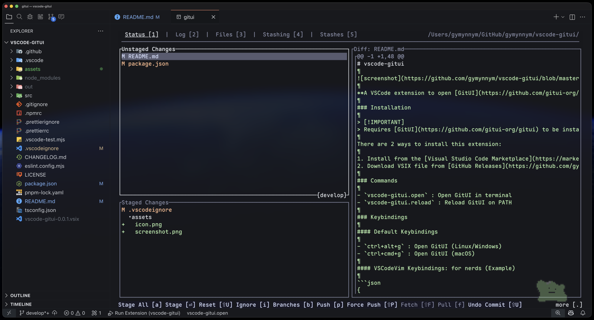

# vscode-gitui



[](https://github.com/gymynnym/vscode-gitui/releases/latest)
[](https://marketplace.visualstudio.com/items?itemName=gymynnym.vscode-gitui)

**A VSCode extension to open [GitUI](https://github.com/gitui-org/gitui) and [Lazygit](https://github.com/jesseduffield/lazygit) in an integrated terminal.**

### Installation

> [!IMPORTANT]
> Requires [GitUI](https://github.com/gitui-org/gitui) or [Lazygit](https://github.com/jesseduffield/lazygit) to be installed and available on your PATH.

There are 2 ways to install this extension:

1. Install from the [Visual Studio Code Marketplace](https://marketplace.visualstudio.com/items?itemName=gymynnym.vscode-gitui)
2. Download VSIX file from [GitHub Releases](https://github.com/gymynnym/vscode-gitui/releases/latest)

### Commands

- `vscode-gitui.open` : Open GitUI/Lazygit in terminal
- `vscode-gitui.reload` : Reload GitUI/Lazygit on PATH

> [!WARNING]
> When running `vscode-gitui.open` in a Python environment, the extension temporarily sets the `python.terminal.activateEnvironment` setting to `false` at the workspace level for better user experience. After execution, the settings is automatically restored to its original value. (If the setting is already `false`, this step is skipped.)

### Keybindings

#### Default Keybindings

- `ctrl+alt+g` : Open GitUI/Lazygit (Linux/Windows)
- `ctrl+cmd+g` : Open GitUI/Lazygit (macOS)

#### VSCodeVim Keybindings: for nerds (Example)

```json
{
  "vim.normalModeKeyBindingsNonRecursive": [
    {
      "before": ["space", "g", "g"],
      "commands": [{ "command": "vscode-gitui.open" }]
    },
    {
      "before": ["space", "g", "r"],
      "commands": [{ "command": "vscode-gitui.reload" }]
    }
  ]
}
```

### Properties

- `vscode-gitui.useWSL` : Enable if using GitUI/Lazygit via WSL (Windows only).
- `vscode-gitui.useLazygit` : Enable if you want to use Lazygit instead of GitUI.
